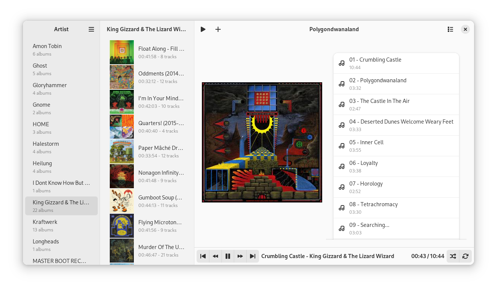

#  RecordBox
A relatively simple, opinionated music player.

## What is it?
RecordBox is a music player designed around listening to music as albums. To this end, it facilitates a paned navigation view to select and filter albums by artist,
as well as a play queue that albums can be added to. It is not meant to be a full music library manager like Rhythmbox, Quod Libet, or Lollypop are. Rather, it is meant to offer a simple method of browsing and playing albums in your music library.

## Why use it?
Well you don't have to. RecordBox was designed specifically to have the bare minimum amount of features needed to support the way I listen to music,
so if the only key feature you need in a music player is the ability to select albums and click play then RecordBox might be for you. If you want playlists or shuffle mode,
than you probably won't like RecordBox much.

Essentially, the inteded niche for this player is to be between Amberol and players like Quod Libet. It was inspired
specifically by Quod Libet and Amberol as a vauge fusion between some of their ideas.

Amberol can open directories and play the audio files in them, which supports the Artist->Album->Play selection that I like, and the simplicity of 
the interface appeales to me, but it doesn't store and display your music library like Quod Libet.  

Quod Libet, on the other hand, was _almost_ exactly what I wanted from a music player, but Quod Libet's paned browser
doesn't show album art. Basically, what I wanted was Quod Libet's album list browser with the Artist/Album filtering of Quod Libet's paned browser.

And that's what RecordBox is for. All it can do is list, filter, and play albums, with a few bells and whistles thrown in.
